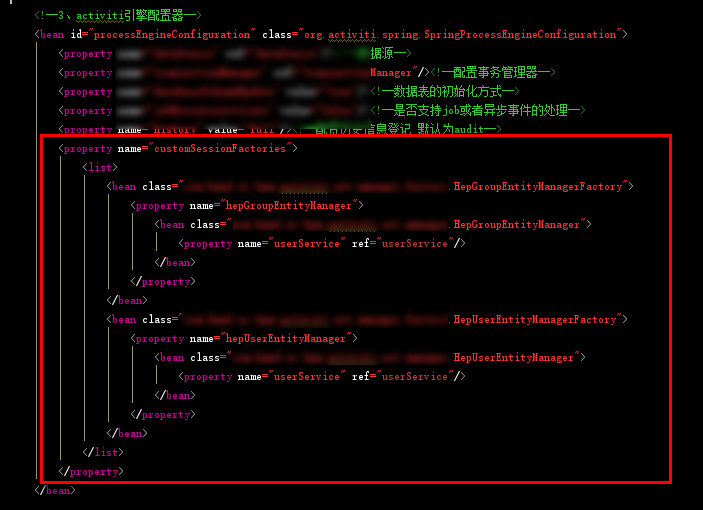

## Activiti中使用自定义用户和用户组
# **一**、实现步骤
* #### Step1:自定义类HepUserEntityManager继承UserEntityManager

```java
public class HepUserEntityManager extends UserEntityManager {

    private UserService userService;

    @Override
    public User createNewUser(String s) {
        throw new UnsupportedOperationException();
    }

    @Override
    public void insertUser(User user) {
        throw new UnsupportedOperationException();
    }

    @Override
    public void updateUser(User user) {
        throw new UnsupportedOperationException();
    }

    @Override
    public User findUserById(String s) {
        throw new UnsupportedOperationException();
    }

    @Override
    public void deleteUser(String s) {
        throw new UnsupportedOperationException();
    }

    @Override
    public List<User> findUserByQueryCriteria(UserQueryImpl userQuery, Page page) {
        List<User> users = null;
        if (null == userQuery) {
            return users;
        }
        users = new ArrayList<>();
        if (null != userQuery.getId()) {
            UserModel model = userService.getUserForUID(userQuery.getId());
            User user = new UserEntity();
            user.setId(model.getUid());
            user.setPassword(model.getPasswordAnswer());
            user.setFirstName(model.getName());
            users.add(user);
        }
        return users;
    }

    @Override
    public long findUserCountByQueryCriteria(UserQueryImpl userQuery) {
        return 1L;
    }

    @Override
    public List<Group> findGroupsByUser(String s) {
        UserModel userModel = userService.getUserForUID(s);
        Set<UserGroupModel> groupModels = userService.getAllUserGroupsForUser(userModel, UserGroupModel.class);
        return Model2Entity.groupModels2Groups(groupModels);
    }

    @Override
    public UserQuery createNewUserQuery() {
        return super.createNewUserQuery();
    }

    @Override
    public IdentityInfoEntity findUserInfoByUserIdAndKey(String s, String s1) {
        throw new UnsupportedOperationException("findUserInfoByUserIdAndKey is not support!");
    }

    @Override
    public List<String> findUserInfoKeysByUserIdAndType(String s, String s1) {
        throw new UnsupportedOperationException("findUserInfoKeysByUserIdAndType is not support!");
    }

    @Override
    public Boolean checkPassword(String s, String s1) {
        return Boolean.TRUE;
    }

    @Override
    public List<User> findPotentialStarterUsers(String s) {
        throw new UnsupportedOperationException("findPotentialStarterUsers is not support!");
    }

    public void setUserService(UserService userService) {
        this.userService = userService;
    }

}
```
---

*  #### Step2自定义类HepGroupEntityManager继承GroupEntityManager
```java
public class HepGroupEntityManager extends GroupEntityManager {

    private UserService userService;

    public HepGroupEntityManager() {
        super();
    }

    public void setUserService(UserService userService) {
        this.userService = userService;
    }

    @Override
    public Group createNewGroup(String s) {
        throw new UnsupportedOperationException("createNewGroup is not support!");
    }

    @Override
    public void insertGroup(Group group) {
        throw new UnsupportedOperationException("insertGroup is not support!");
    }

    @Override
    public void updateGroup(Group group) {
        throw new UnsupportedOperationException("updateGroup is not support!");
    }

    @Override
    public void deleteGroup(String s) {
        throw new UnsupportedOperationException("deleteGroup is not support!");
    }

    @Override
    public GroupQuery createNewGroupQuery() {
        return super.createNewGroupQuery();
    }

    @Override
    public List<Group> findGroupByQueryCriteria(GroupQueryImpl groupQuery, Page page) {

        throw new UnsupportedOperationException("findGroupByQueryCriteria is not support!");
    }

    @Override
    public long findGroupCountByQueryCriteria(GroupQueryImpl groupQuery) {
        throw new UnsupportedOperationException("findGroupCountByQueryCriteria is not support!");
    }

    @Override
    public List<Group> findGroupsByUser(String s) {
        UserModel model = userService.getUserForUID(s);
        Set<UserGroupModel> groupModels = userService.getAllUserGroupsForUser(model);
        return Model2Entity.groupModels2Groups(groupModels);
    }
}
```
> ### 注意
> 1、 此处与上一步几乎类似，只是把相关的用户组查询操作移交给userService来完成。

---

* ### Step3:实现UserEntityManager的自定义工产
```java
public class HepUserEntityManagerFactory implements SessionFactory {

    private HepUserEntityManager hepUserEntityManager;

    @Override
    public Class<?> getSessionType() {
        return UserIdentityManager.class;
    }

    @Override
    public Session openSession() {
        return hepUserEntityManager;
    }

    public void setHepUserEntityManager(HepUserEntityManager hepUserEntityManager) {
        this.hepUserEntityManager = hepUserEntityManager;
    }
}
```
> #### 注意：
> 1: 注意此处的getSessionType返回的仍是acyiviti默认实现的UserIdentityManager.class。这样做的目的是为了之后可以替换activiti的默认实现做准备。
> 2: openSessio方法返回的确实我们自定义的HepUserEntityManager的实例
> 3: getSessionType()相当于返回一个键，openSession()返回对应的值。
---

* #### Step4:实现GroupEntityManager的自定义工产
```java
public class HepGroupEntityManagerFactory implements SessionFactory {

    private HepGroupEntityManager hepGroupEntityManager;

    @Override
    public Class<?> getSessionType() {
        return GroupIdentityManager.class;
    }

    @Override
    public Session openSession() {
        return hepGroupEntityManager;
    }

    public HepGroupEntityManager getHepGroupEntityManager() {
        return hepGroupEntityManager;
    }

    public void setHepGroupEntityManager(HepGroupEntityManager hepGroupEntityManager) {
        this.hepGroupEntityManager = hepGroupEntityManager;
    }
}
```
> #### 注意：
> 原理同上一步
---

* ####Step5:配置替换默认实现

---

# **二**、实现原理
通过以上内容我们已经成功替换了activiti的默认用户和用户组实现。下面我们来阐释其替换原理
#### 阅读activiti的配置器源码ProcessEngineConfigurationImpl
```java
public abstract class ProcessEngineConfigurationImpl extends ProcessEngineConfiguration {

    protected List<SessionFactory> customSessionFactories;
    protected Map<Class<?>, SessionFactory> sessionFactories;


    protected void initSessionFactories() {
        if (this.sessionFactories == null) {
            this.sessionFactories = new HashMap();
            if (this.dbSqlSessionFactory == null) {
                this.dbSqlSessionFactory = new DbSqlSessionFactory();
            }

            this.dbSqlSessionFactory.setDatabaseType(this.databaseType);
            this.dbSqlSessionFactory.setIdGenerator(this.idGenerator);
            this.dbSqlSessionFactory.setSqlSessionFactory(this.sqlSessionFactory);
            this.dbSqlSessionFactory.setDbIdentityUsed(this.isDbIdentityUsed);
            this.dbSqlSessionFactory.setDbHistoryUsed(this.isDbHistoryUsed);
            this.dbSqlSessionFactory.setDatabaseTablePrefix(this.databaseTablePrefix);
            this.dbSqlSessionFactory.setTablePrefixIsSchema(this.tablePrefixIsSchema);
            this.dbSqlSessionFactory.setDatabaseCatalog(this.databaseCatalog);
            this.dbSqlSessionFactory.setDatabaseSchema(this.databaseSchema);
            this.dbSqlSessionFactory.setBulkInsertEnabled(this.isBulkInsertEnabled, this.databaseType);
            this.dbSqlSessionFactory.setMaxNrOfStatementsInBulkInsert(this.maxNrOfStatementsInBulkInsert);
            this.addSessionFactory(this.dbSqlSessionFactory);
            this.addSessionFactory(new GenericManagerFactory(AttachmentEntityManager.class));
            this.addSessionFactory(new GenericManagerFactory(CommentEntityManager.class));
            this.addSessionFactory(new GenericManagerFactory(DeploymentEntityManager.class));
            this.addSessionFactory(new GenericManagerFactory(ModelEntityManager.class));
            this.addSessionFactory(new GenericManagerFactory(ExecutionEntityManager.class));
            this.addSessionFactory(new GenericManagerFactory(HistoricActivityInstanceEntityManager.class));
            this.addSessionFactory(new GenericManagerFactory(HistoricDetailEntityManager.class));
            this.addSessionFactory(new GenericManagerFactory(HistoricProcessInstanceEntityManager.class));
            this.addSessionFactory(new GenericManagerFactory(HistoricVariableInstanceEntityManager.class));
            this.addSessionFactory(new GenericManagerFactory(HistoricTaskInstanceEntityManager.class));
            this.addSessionFactory(new GenericManagerFactory(HistoricIdentityLinkEntityManager.class));
            this.addSessionFactory(new GenericManagerFactory(IdentityInfoEntityManager.class));
            this.addSessionFactory(new GenericManagerFactory(IdentityLinkEntityManager.class));
            this.addSessionFactory(new GenericManagerFactory(JobEntityManager.class));
            this.addSessionFactory(new GenericManagerFactory(ProcessDefinitionEntityManager.class));
            this.addSessionFactory(new GenericManagerFactory(ProcessDefinitionInfoEntityManager.class));
            this.addSessionFactory(new GenericManagerFactory(PropertyEntityManager.class));
            this.addSessionFactory(new GenericManagerFactory(ResourceEntityManager.class));
            this.addSessionFactory(new GenericManagerFactory(ByteArrayEntityManager.class));
            this.addSessionFactory(new GenericManagerFactory(TableDataManager.class));
            this.addSessionFactory(new GenericManagerFactory(TaskEntityManager.class));
            this.addSessionFactory(new GenericManagerFactory(VariableInstanceEntityManager.class));
            this.addSessionFactory(new GenericManagerFactory(EventSubscriptionEntityManager.class));
            this.addSessionFactory(new GenericManagerFactory(EventLogEntryEntityManager.class));
            this.addSessionFactory(new DefaultHistoryManagerSessionFactory());
            this.addSessionFactory(new UserEntityManagerFactory());
            this.addSessionFactory(new GroupEntityManagerFactory());
            this.addSessionFactory(new MembershipEntityManagerFactory());
        }

        if (this.customSessionFactories != null) {
            Iterator var1 = this.customSessionFactories.iterator();

            while(var1.hasNext()) {
                SessionFactory sessionFactory = (SessionFactory)var1.next();
                this.addSessionFactory(sessionFactory);
            }
        }

    }

    public void addSessionFactory(SessionFactory sessionFactory) {
        sessionFactories.put(sessionFactory.getSessionType(), sessionFactory);
    }
}
```
> #### 注意：
> 1: 此处只是截取了部分核心代码，便于理解
> 2: 通过代码可以看到所有的实体管理类xxxEntityManager都在方法initSessionFactories()中被加载，包括UserEntityManager和GroupEntityManager。
> 3：customSessionFactories 用于加载用户自定义的SessionFactory，并且晚于默认的SessionFactory被加载（这些在源码中都有体现）。
> 4、sessionFactories是方法initSessionFactories()操作的最终结果，并且其是一个Map结构。Map的键是Class，值是SessionFactory的实例。我们自定义的工厂HepGroupEntityManagerFactory和HepUserEntityManagerFactory也同样实现了SessionFactory接口，并且通过方法getSessionType()返回的是activiti默认的用户和用户组管理类UserIdentityManager.class和GroupIdentityManager.class。键相同但是值不同，这就是我们替换的原理。
<!--<meta http-equiv="refresh" content="0.1">-->
