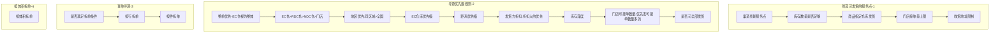

```mermaid
graph TB
subgraph 筛选可发货的服务点-1
A1[渠道关联服务点] --> B1[库存数量是否足够]
B1 --> C1[商品指定仓库发货]
C1 --> D1[门店接单量上限]
D1 --> E1[收货地址限制]
end
subgraph 寻源优先级规则-2
A2[整单优先-EC仓视为整体] --> B2[EC仓>RDC仓>NDC仓>门店]
B2 --> C2[地区优先:同区域>全国]
C2 --> D2[EC仓库优先级]
D2 --> E2[距离优先级]
E2 --> F2[发货方折扣:折扣大的优先]
F2 --> G2[库存深度]
G2 --> H2[门店可接单数量,优先发可接单数量多的]
H2 --> I2[是否可全部发货]
end
subgraph 查单寻源-3
A3[是否满足拆单条件] --> B3[按行拆单]
B3 --> C3[按件拆单]
end

subgraph 按体积拆单-4
A4[按体积拆单]
end
```
### 一、 疑惑
* 1、渠道关联服务点。哪些渠道？（线上、线下、B2B）
* 2、门店接单上限，指订单还是分配到的配货单？
* 3、门店可接单数量、门店接单上限啥关系？
* 3、收货地址限制具体指什么？（被限制区域仓库不发货？）
* 4、是否可全部发货？如果没有配齐商品就不发货吗？
* 5、如果指定的仓库缺货？是拆单还是转异常
