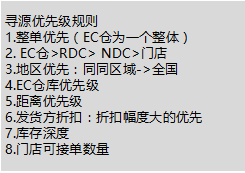

一、有如下一种结构

|               配货单                   |
| --------   | -----:     | :----:       |
|   商品sku  |  商品数量   |   可发货仓库  |
|   1     |  5         |  A,C,F          |
|   2     |  5         |  B,D,F,E        |
|   3     |  5         |  A,E,C          |

总共有 A B C D E F 五个仓库。

 寻源优先级规则:竟可能的少拆单的情况下，选择满足条件最多的拆单情况。

#### 问题分析
* 上面的配货单，根据每一行的可发货仓库，无法找到交集。所以不满足规则1.
* 目前最少拆单，拆成两单的情况有:
  * **{[1,3]:[A,C];  [2]:[B,D,F,E]}**
  * **{[1,2]:[F];    [3]:[A,E,C]}**
  * **{[2,3]:[E];    [1]:[A,C,F]}**
* 最后最好的结果是,原订单下拆单生成的子订单满足规则数目(score)的和最大。

例如：
* 第二种情况的子订单[1,2]:[F] 只有一个地址，则该子订单仅满足规则1。所以他的score = 1
* 第二种情况的子订单[3]:[A,E,C],满足规则1，然后继续去第二条规则(假设经过规则2后，其可发货地址仅剩下一个，则不继续向下判断其score = 2;如果经过规则2其可发货地址还剩下[E,C]则继续向下，经过3后只剩下一个可发货地址，则结束其score = 3);
* 最后把子订单[1,2]:[F]的score和[3]:[A,E,C]的score求和就是该配货单的score。

# 尽可能的少拆单，你有思路吗？

|               配货单                   |
| --------   | -----:     | :----:       |
|   商品sku  |  商品数量   |   可发货仓库  |
|   1     |  5         |  A,C,F          |
|   2     |  5         |  B,D,F,E        |
|   3     |  5         |  A,E,C          |

现有N个任务,可以由M个人来完成，每个人可以同时完成多个工作，每个任务由于技术需求，不是每个人都可以做.
* 假设现有任务:task1,task2,task3。和人员A,B,C,D,E,F。
* 任务和可执行的人员之间的关系：
  * task1 只能由{A,C,F}来完成
  * task2 只能由{B,D,F,E}来完成
  * task3 只能由{A,E,C}来完成
  现在要求使用最少的人员，来完成工作task1，task2，task3。列出所有的方案？
